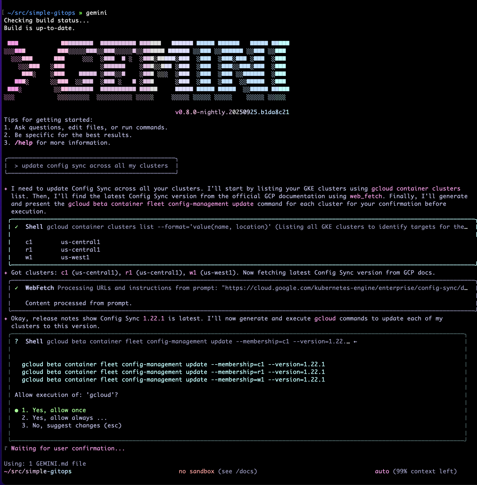
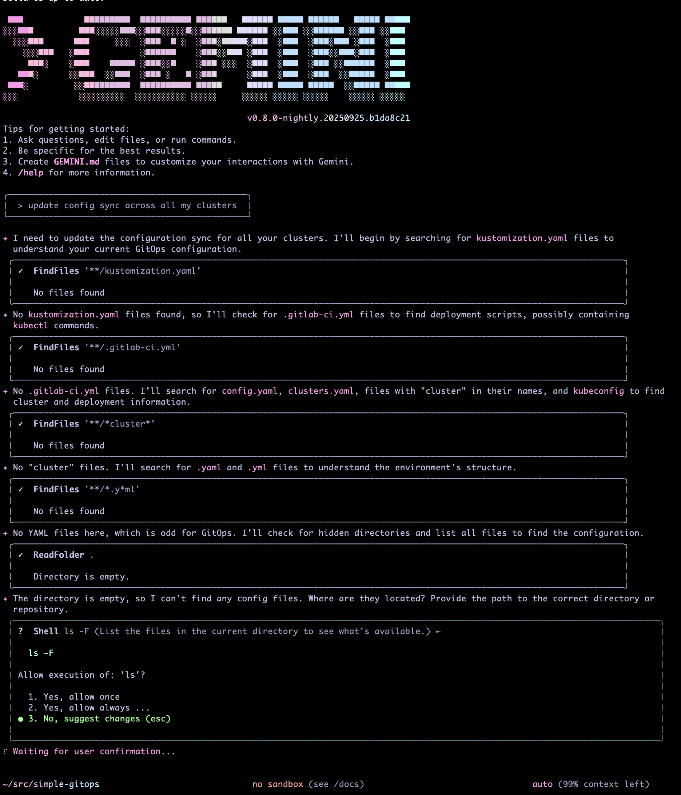

# GitOps Extension

This project provides a Gemini CLI extension that helps someone work on GitOps workflows. 
It covers key tools, operational commands, and troubleshooting steps for popular GitOps 
tools Config Sync (GCP), ArgoCD, and FluxCD.

## Features
1. Generating a bugreport
1. Initializing a repository using the `nomos` command
1. Hydrating a repository using `nomos` command.
1. Migration of the clusters and repositories.
1. Getting the status of GitOps pipelines that use Config Sync.
1. Ability to vet the current configuration.
1. Ability to utilize `gcloud` to manage the Config Sync instances.

## Exxtension Impact

Here is a side by side test of Gemini CLI operating with this extension and without. You can see
that when the extension is present LLM is more successful at issuing the right commands
to upgrade Config Sync clusters.

Upgrade when the extension is installed:


Same prompt without the extension installed



## Local Installation (Gemini CLI Extension)
To install and use this extension locally with `gemini-cli`, follow these steps:

1. Clone this repository (if not already done):
	```sh
	git clone https://github.com/mikebz/gitops-extension.git
	```
2. Link the extension locally using Gemini CLI:
	```sh
	gemini extension link /path/to/gitops-extension
	```
	Replace `/path/to/gitops-extension` with the actual path to your extension file.
3. Verify the extension is linked:
	```sh
	gemini extension list
	```
4. For more details, see the official [Gemini CLI Extension Guide](https://github.com/google-gemini/gemini-cli/blob/main/docs/extension.md).

## Supported Tools
- **kubectl**: Command-line tool for managing Kubernetes resources
- **kustomize**: Customization of Kubernetes YAML manifests
- **Config Sync (GCP)**: Native GitOps for Google Kubernetes Engine
- **ArgoCD**: Declarative GitOps continuous delivery for Kubernetes
- **FluxCD**: GitOps operator for Kubernetes with automation and reconciliation

## Operations
See `gitops.md` for detailed operational commands, including:
- Installing and configuring Config Sync
- Upgrading and checking versions
- Troubleshooting common issues
- Managing deployments with ArgoCD and FluxCD

## Best Practices
- Store all Kubernetes manifests in Git
- Use overlays for environment separation
- Automate deployments and monitor cluster health
- Protect main branches and require PR reviews

## Resources
- [GCP GitOps Best Practices](https://cloud.google.com/kubernetes-engine/enterprise/config-sync/docs/concepts/gitops-best-practices)
- [Config Sync Release Notes](https://cloud.google.com/kubernetes-engine/docs/release-notes-config-sync)
- [ArgoCD Documentation](https://argo-cd.readthedocs.io/)
- [FluxCD Documentation](https://fluxcd.io/)

---
For more details, see the context files in this repository or reach out to the project owner.
